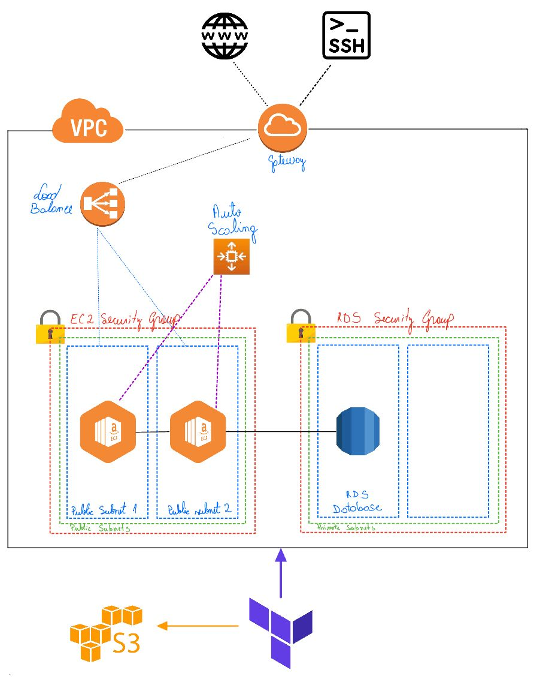
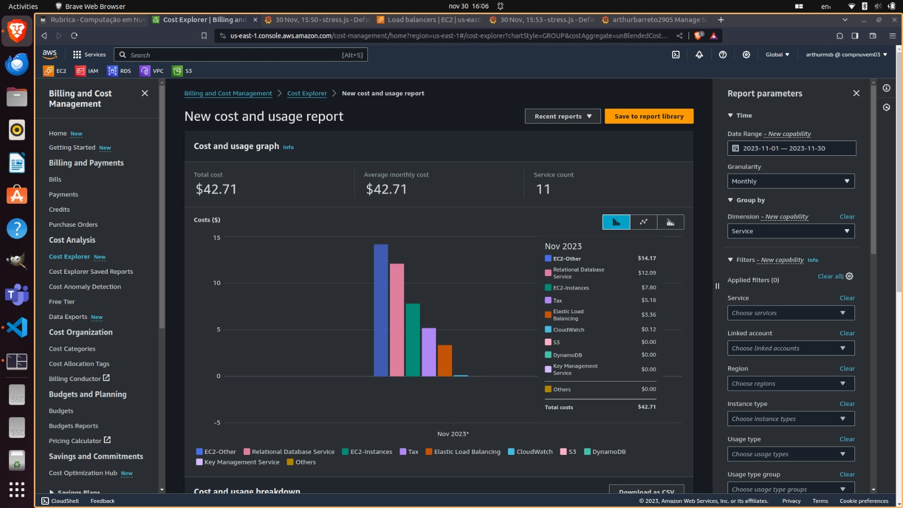
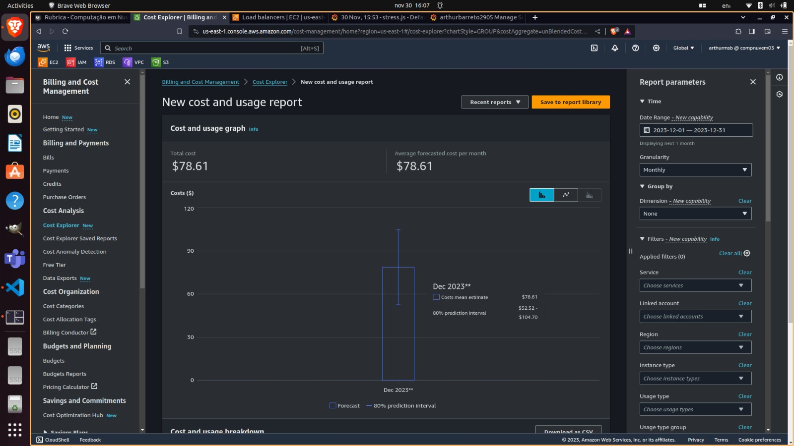

# Cloud Architecture Implementation on AWS with Terraform

## Project Overview

This project showcases the implementation of a scalable and resilient cloud architecture on Amazon Web Services (AWS) using Infrastructure as Code (IaC) principles with Terraform. The architecture includes the following components:

- **Application Load Balancer (ALB):** Ensures efficient distribution of incoming traffic across multiple EC2 instances for enhanced availability and fault tolerance.

- **EC2 with Auto Scaling Group (ASG):** Utilizes auto-scaling capabilities to dynamically adjust the number of EC2 instances based on traffic load, ensuring optimal performance and resource utilization.

- **RDS mySQL Database with Multi-AZ:** Implements a reliable and highly available relational database using Amazon RDS with Multi-Availability Zone (Multi-AZ) configuration.

- **S3 Bucket for Terraform State File:** Manages and stores the Terraform state file securely in an S3 bucket, facilitating collaboration and version control.

- **CloudWatch for Monitoring:** Monitors key metrics such as CPU Utilization and Request Count to gain insights into system performance and health.

- **Estimation of Monthly Costs with AWS Pricing Calculator:** Provides an estimate of the monthly costs associated with the deployed AWS resources using the AWS Pricing Calculator.

- **Architecture Diagram:** Visual representation of the implemented cloud architecture.

- **Deployment Instructions:** Step-by-step instructions for deploying the infrastructure on AWS.

- **Destruction Instructions:** Guidance on how to tear down and destroy the deployed infrastructure when needed.

- **Testing Instructions:** Instructions for testing the infrastructure to ensure it functions as expected.

- **k6 + Grafana for Load Testing:** Utilizes k6 and Grafana for load testing the deployed infrastructure, ensuring it can handle various levels of traffic and load.

## Architecture Diagram



## Deployment Instructions

1. Clone the repository to your local machine.

2. Go to `create-bucket` directory and follow the instructions in the README file to create an S3 bucket for storing the Terraform state file.

3. Back in the root directory, run the following command launch the infrastructure on AWS:

    ```bash
    terraform init
    ```

    ```bash
    terraform validate
    ```

    ```bash
    terraform plan
    ```

    ```bash
    terraform apply
    ```

4. While apply the `terraform command`, insert the following values when prompted:

    - **db_password:** Enter a password for the RDS database.

    - **db_name:** Enter a name for the RDS database.

## Testing Instructions

1. After the infrastructure has been successfully deployed, copy the **ALB DNS Name** from the Terraform output and go to **k6_stress_test** directory. Follow the instructions in the README file to run the load test.


## Cost Estimation

[Cost Estimation](./img/estimativa_custos.pdf)

## Technical Decisions

In designing the architecture, several key technical decisions were made to optimize performance, cost, and availability for the project. Each decision is outlined below:

### Region Selection (us-east-1)

- **Decision:** The project is deployed in the **us-east-1** region, chosen for its cost-effectiveness. Considering the application's nature as a CRUD (Create, Read, Update, Delete) system focusing on *name* and *email* for study purposes, selecting the most economical region aligns with the project's educational goals.

### EC2 Instance Type (t2.micro)

- **Decision:** The project utilizes the **t2.micro** instance for EC2 deployment. Given the CRUD-centric nature of the application, a low-cost instance like t2.micro provides sufficient resources for handling basic operations. This decision aligns with cost-efficiency while meeting the project's performance requirements.

### RDS Instance Type (db.t2.micro with Multi-AZ)

- **Decision:** The project employs the **db.t2.micro** instance for RDS, optimized for CRUD operations. Additionally, Multi-Availability Zone (Multi-AZ) deployment ensures high availability and fault tolerance. The choice of **General Purpose SSD (GP2)** storage with 10GB capacity surpasses the project's storage needs, offering scalability for potential future requirements.

### CloudWatch Integration

- **Decision:** The project incorporates **CloudWatch** for monitoring both EC2 and RDS instances. Key metrics such as CPU Utilization and Request Count are tracked. For CPU utilization, scaling policies are set at 70% to trigger scaling up and 30% for scaling down, ensuring resource efficiency. Similarly, the Request Count metric is configured with thresholds (250 for scaling up) and a 15-minute cooldown to prevent rapid scaling down.

These technical decisions collectively aim to strike a balance between performance, cost-effectiveness, and system resilience, aligning with the project's educational focus on understanding fundamental AWS services and best practices in cloud architecture.

## Real Cost - AWS Cost Explorer

Over the past days, I have been actively testing the application and closely monitoring costs through AWS Cost Explorer. The following images showcase the cost usage and predictions from November 1st to November 30th.

### Cost Usage Analysis (November 1st to November 30th)



The graph illustrates the cost usage of the infrastructure during the stated period. Notably, components such as RDS, EC2, and EC2(others) significantly contribute to the overall expenses.

### Infrastructure Cost Prediction after Stress Testing



Following stress testing, the graph predicts the cost for the next month. Noteworthy contributors to the cost, such as RDS and EC2, indicate potential areas for optimization.

### Cost Optimization Strategies

After stress testing the application, it's evident that certain elements contribute more substantially to the infrastructure cost. Consider the following strategies for cost optimization:

- **EC2 Instances:** Evaluate and potentially reduce the number of EC2 instances to optimize costs. Determine the optimal balance between performance and resource utilization.

- **RDS Instance Size:** Consider downsizing the RDS instance if feasible without compromising application performance. Evaluate the required resources for the database workload.

### Estimated Monthly Cost with Stress Testing

In the second image, the estimated cost of the infrastructure post-stress testing is approximately $78.61 per month. The actual cost may fall within the range of $52.52 to $104.70 monthly. This estimation provides insights into potential fluctuations in costs under varying workloads.

These observations and strategies aim to guide further optimizations in the infrastructure, ensuring a cost-effective yet performant cloud architecture.
