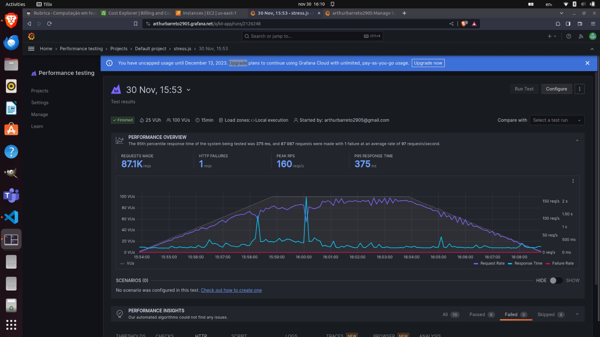
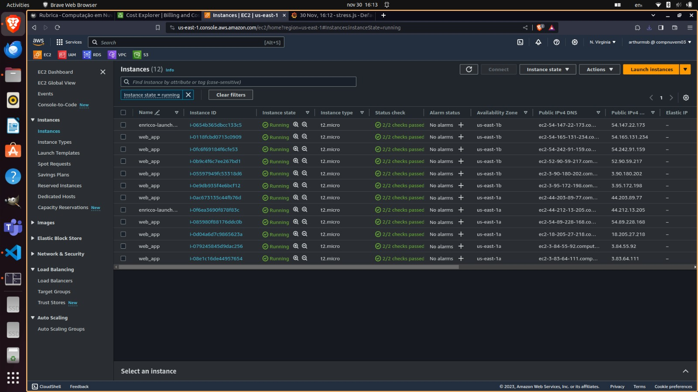

# Project Setup and Testing Guide

## Installation on Linux

1. Grant execution permissions to the installation script:

    ```bash
    chmod +x install.sh
    ```

2. Execute the installation script:

    ```bash
    ./install.sh
    ```

## Installation on Other Distributions

For installation on distributions other than Linux, please refer to the official [k6 documentation](https://k6.io/docs/get-started/installation/).

## Testing Instructions

1. Copy the **DNS name** of the load balancer generated by the Terraform script.

2. Open the **config.js.exemple** file and paste the copied **DNS name** into the **DNS** variable. Then, rename the file to **config.js**.

3. Create an account on [Grafana Cloud for k6](https://grafana.com/docs/grafana-cloud/k6/get-started/run-cloud-tests-from-the-cli/#run-locally-and-stream-to-the-cloud).

4. Obtain your authentication token by following the instructions in the [k6 documentation](https://k6.io/docs/results-output/real-time/cloud/).

5. Run the following command to log in using the obtained token:

    ```bash
    k6 login cloud --token <your token>
    ```

6. Run the test locally and view the results in Grafana Cloud:

    ```bash
    k6 run stess.js -o cloud
    ```

7. Click the link displayed in the terminal to view the results in Grafana Cloud.

   The Grafana test results will appear as follows:

   

8. On the AWS dashboard, navigate to the EC2 service to monitor running instances and verify the effectiveness of autoscaling:

   
